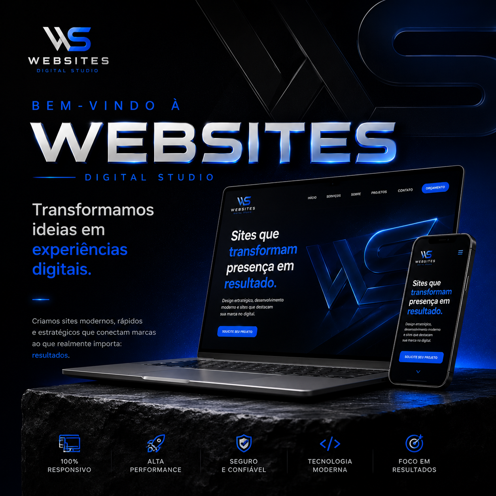

<div align="center">

# Antony Digital Studio

### Portfólio profissional de Desenvolvimento Web, Front-end e UI/UX

Projeto autoral criado para apresentar trabalhos, serviços e minha evolução prática no desenvolvimento de experiências digitais.

[](https://antony-digital-studio.vercel.app/)

</div>

---

## Sobre o projeto

O **Antony Digital Studio** é meu portfólio profissional e espaço de apresentação de projetos de Desenvolvimento Web.

A proposta é reunir identidade visual, projetos reais, serviços e formas de contato em uma experiência responsiva, com atenção à hierarquia visual, usabilidade e apresentação profissional.

O projeto também funciona como parte da minha evolução em **Análise e Desenvolvimento de Sistemas**, permitindo aplicar conhecimentos de HTML, CSS, JavaScript, responsividade, UI/UX e publicação de aplicações web.

---

## Preview



---

## Projetos apresentados

### Skylish Fluency
Plataforma educacional web voltada à aprendizagem de idiomas, com experiência responsiva e ambiente digital próprio.

### Maria Júlia Makeup
Projeto web desenvolvido para apresentação profissional de serviços de maquiagem, com foco visual e experiência mobile.

---

## Tecnologias


---

## Principais características

- Layout responsivo para desktop e mobile
- Identidade visual própria
- Seção de projetos e cases
- Apresentação de serviços
- Integração de contato via WhatsApp
- Links para redes sociais
- Interações e efeitos com JavaScript
- Estrutura sem dependência de framework
- Publicação web pela Vercel

---

## Estrutura

```text
antony-digital-studio/
├── assets/
│   ├── logo-ads.svg
│   ├── antony-gabriel-destaque.jpeg
│   ├── maria-julia-mockup.png
│   ├── skylish-fluency-mockup.png
│   └── social-share.png
├── case-maria-julia.html
├── case-skylish.html
├── index.html
├── obrigado.html
├── script.js
├── style.css
└── README.md
```

---

## Projeto online

### [Acessar Antony Digital Studio](https://antony-digital-studio.vercel.app/)

---

## Autor

### Antony Gabriel

Estudante de **Análise e Desenvolvimento de Sistemas (ADS)**, com foco em **Desenvolvimento Web, Front-end e UI/UX**.

[](https://github.com/antonygabrieldev)

---

<div align="center">

**Desenvolvimento Web • Front-end • UI/UX**

Projeto desenvolvido como parte da minha evolução profissional em tecnologia.

</div>
